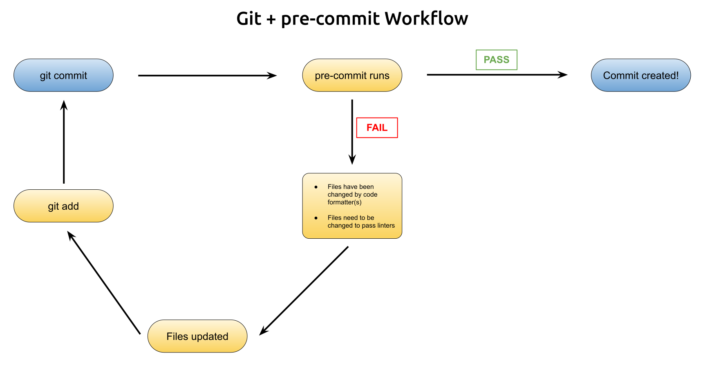

# pre-commit Tutorial

[pre-commit](https://pre-commit.com/) is a convenient gatekeeper package that helps you commit high-quality code. It works by running code linters & formatters against the code you commit to make sure that it looks just right.




## Installation
To install pre-commit, you have a few options:

```bash
pip install pre-commit
```
or
```bash
conda install -c conda-forge pre-commit
```
>for all installation options, follow this link: https://pre-commit.com/#installation

## Create the pre-commit config
The pre-commit configuration file is where you specify which formatters, linters, and stylers (known as hooks) that pre-commit will use to check your code. [Here is a link with the list of supported hooks.](https://pre-commit.com/hooks.html)

pre-commit looks for a `.pre-commit-config.yaml` file in the root directory of your Git repo. An example pre-commit config file can be found in this repo. ([example](./pre-commit-config.yaml))

## Register pre-commit with Git
To register pre-commit with Git, run the following:
This can be done by running the following:
```bash
pre-commit install
```
Now, when you commit, pre-commit will run.


## Q & A
### Q: I'm am getting a **CalledProcessError**. What should I do?
**A:** While working to get pre-commit on a teammate's machine, I ran into a **CalledProcessError**. Luckily, I was able to get around it with the answer to this post on [Stack Overflow](https://stackoverflow.com/questions/65192345/calledprocesserror-with-git-pre-commit-hook) by simply pinning my version of `virtualenv` to 20.0.33.
Just run the following:
```bash
pip install virtualenv==20.0.33
```

### Q: My code formatters are fighting! What do I do?
**A:** Sometimes, you may run into an issue where one formatter (like isort) wants your code to look one way and another (like black) wants it to look another way. When you find your code bouncing endlessly between formatters, here is what I do:
- Make sure that no other issues are being reported by pre-commit
- skip pre-commit with `git commit --no-verify`

# Learn More
Hopefully this helped you get up and running using pre-commit. For more information about pre-commit, I highly recommend watching this great [video series on pre-commit](https://calmcode.io/pre-commit/the-problem.html) by Vincent Warmerdam on [calmcode.io](https://calmcode.io).

Happy coding!
